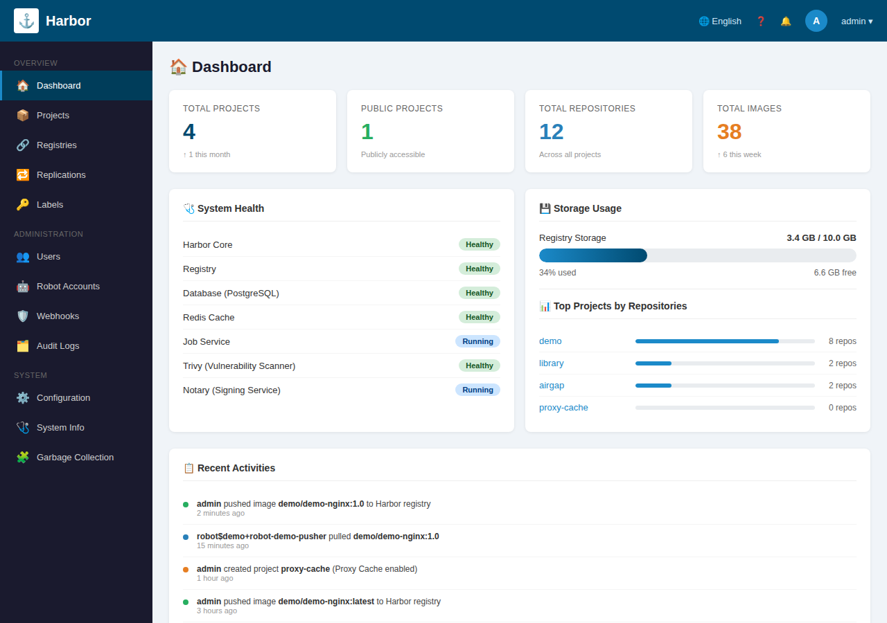
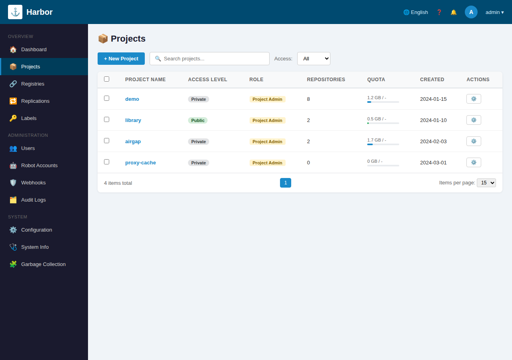
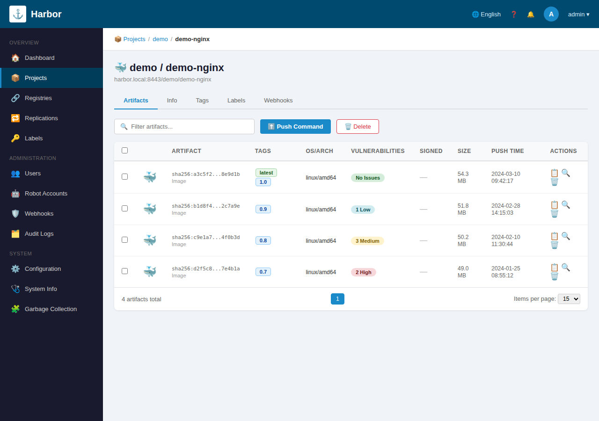

# Harbor WSL2 Lab (Windows + WSL2 + Docker Desktop)
이 repo는 **Harbor를 “폐쇄망 운영 방식”으로 학습**할 수 있도록, Chapter(01~)별로
- 상세 설명(README)
- 실행 가능한 `.sh` 스크립트
- (선택) Windows PowerShell 보조 스크립트
를 제공합니다.

> 권장 환경: **Windows 10/11 + WSL2(Ubuntu) + Docker Desktop (WSL integration ON)**

## 빠른 시작
```bash
cp .env.example .env
chmod +x -R chapters/**/run.sh scripts/*.sh
./chapters/01_check_env/run.sh
```

---
```
# 최신 릴리즈를 받는 대신, 안정적으로 특정 버전 고정 추천
KIND_VER="v0.22.0"

curl -Lo /usr/local/bin/kind "https://kind.sigs.k8s.io/dl/${KIND_VER}/kind-linux-amd64"
chmod +x /usr/local/bin/kind
kind version
```
---
```
sudo apt-get update
sudo apt-get install -y kubectl
kubectl version --client --output=yaml | head
```
 
## Chapter 목록
- Chapter 01: 환경 점검 (Docker Desktop + WSL2)
- Chapter 02: Harbor(HTTPS self-signed) 설치/기동
- Chapter 03: hosts/CA 신뢰 체인 등록 (Docker가 TLS 신뢰하도록)
- Chapter 04: 프로젝트 생성 & Robot Account(개념/실습)
- Chapter 05: 샘플 nginx 이미지 빌드 → Harbor push/pull → 실행
- Chapter 06: “폐쇄망 시뮬레이션” (save/load/tar 반입 흐름)
- Chapter 07: 이미지 보존(Retention) & 태그 운영 습관
- Chapter 08: (옵션) 로컬 kind 클러스터에서 Harbor 이미지 pull 테스트
- Chapter 09: 백업/복구(개념) + 데이터 폴더 관리
- Chapter 10: 정리(Down/Cleanup)
- Chapter 11: Harbor Proxy Cache(실무: 외부 레지스트리 캐시/미러)
- Chapter 12: vLLM 추론 서버 이미지 스켈레톤(대형모델 운영 베이스)
- Chapter 13: K8s 배포 템플릿(vLLM + imagePullSecret + Probe + NodePort)
- Chapter 14: Fractos RCS UI 입력값 시트 생성(WSL/K8s 없어도 가능)
- Chapter 15: Fractos RCS UI 배포 런북(모델/NFS/TP=3/NodePort/HealthCheck)
- Chapter 16: 폐쇄망 운영 검증 시나리오(반입→Harbor→Fractos 배포 전 점검)
- Chapter 17: kind 빠른 K8s 클러스터 생성/삭제(WSL2+Docker 기반)
- Chapter 18: kind에서 Harbor(HTTPS) 이미지 pull + 배포(Secret/CA 포함)


## Harbor 웹 UI 스크린샷

### 1. 대시보드 (Dashboard)
프로젝트 수, 이미지 수, 시스템 상태, 스토리지 사용량, 최근 활동 등을 한눈에 확인할 수 있는 메인 화면입니다.



### 2. 프로젝트 목록 (Projects)
생성된 프로젝트 목록과 접근 권한(Public/Private), 저장소 수, 할당량(Quota) 등을 관리하는 화면입니다.



### 3. 이미지 아티팩트 목록 (Repository / Artifacts)
프로젝트 내 특정 저장소에 push된 이미지 태그, 다이제스트, 취약점 스캔 결과, 이미지 크기 등을 확인하는 화면입니다.



---

## 중요한 개념
- **Harbor는 “내부 레지스트리”**: 폐쇄망에서는 Docker Hub 대신 Harbor만 바라보도록 구성
- **Docker가 외부망 필수는 아님**: 외부 pull/패키지 다운로드가 인터넷이 필요할 뿐, 내부 Harbor만 쓰면 인터넷 없이 운영 가능
- **HTTPS(자체서명/사내CA)가 실무 표준**: Docker/노드 런타임이 해당 CA를 신뢰하도록 “trust chain 등록”이 핵심

## 포트/도메인 기본값
- HTTPS UI/Registry: `https://harbor.local:8443`
- HTTP(선택): `http://harbor.local:8080`
- 변경은 `.env`에서 가능

## 주의
- Chapter 03의 “Windows CA 등록”은 보안상 관리자 권한이 필요할 수 있어 자동화 범위를 제한합니다.
- 회사/기관 정책에 따라 로컬 PC의 인증서 저장소 변경이 제한될 수 있습니다.


### 추가 시나리오
- CH18-robot: Robot Account(pull-only)로 kind에서 Harbor 이미지 pull 배포
